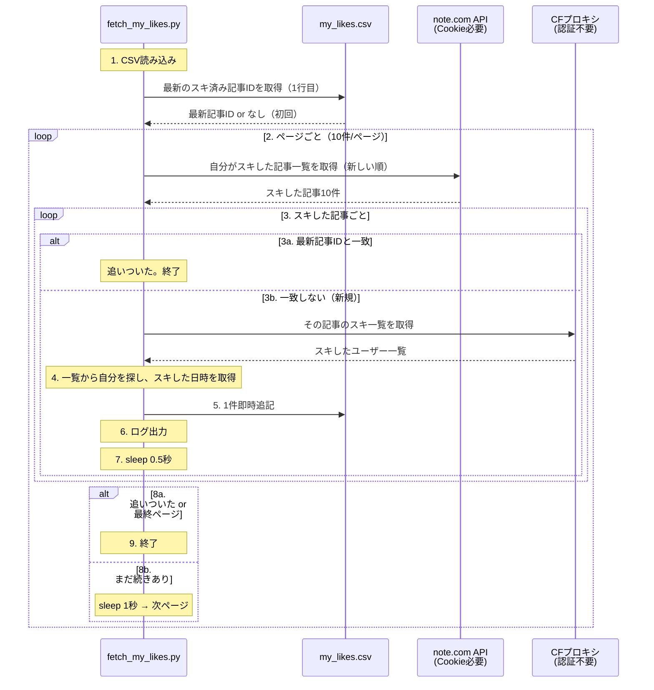
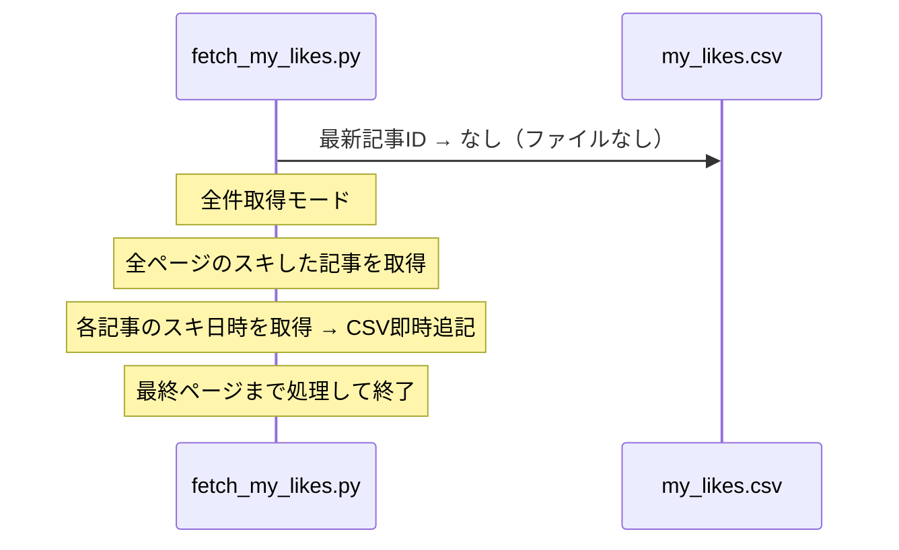
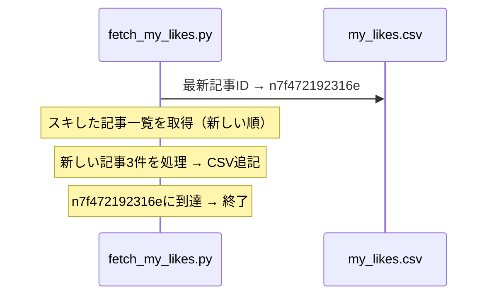
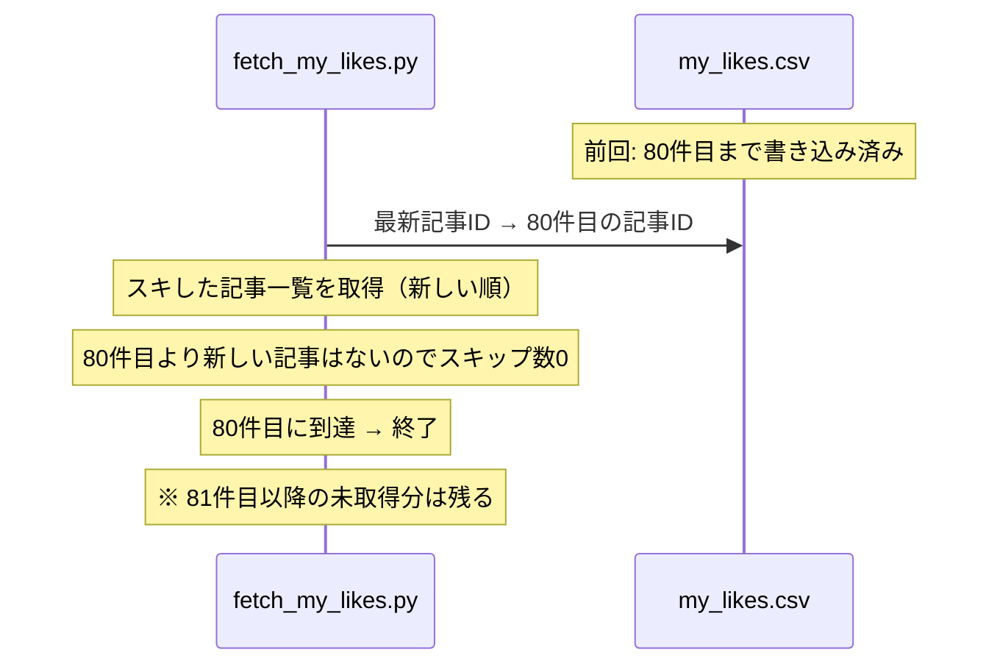

# fetch_my_likes.py 設計

## 概要

自分がスキした記事とそのタイミングをCSVに蓄積するスクリプト。

## シーケンス図

## 初回実行

## 2回目以降（差分取得）

## 異常終了 → 再開

## 異常終了の課題

上記のように、最新記事IDベースだと**81件目以降が取得されない**。
対策: 初回実行が途中で失敗した場合は、CSVを削除して再実行する。
2回目以降の差分取得では数件なので、途中失敗のリスクは低い。

## CSV仕様

保存順: スキした日時の**新しい順**（先頭が最新）

| カラム | 内容 | 例 |
|---|---|---|
| liked_at | 自分がスキした日時 | 2026-03-20T17:14:06.000+09:00 |
| note_key | スキした記事のID | n7f472192316e |
| author_urlname | 記事の著者のurlname | ktcrs1107 |
| author_name | 記事の著者の表示名 | KITAcore｜キタコレ |
| article_title | 記事タイトル | noteダッシュボードを... |

## API仕様

| API | 認証 | レート制限対策 |
|---|---|---|
| /api/v1/notes/liked | Cookie必要 | 1秒/ページ |
| /api/v3/notes/{key}/likes | 不要（CFプロキシ経由） | 0.5秒/記事 |
